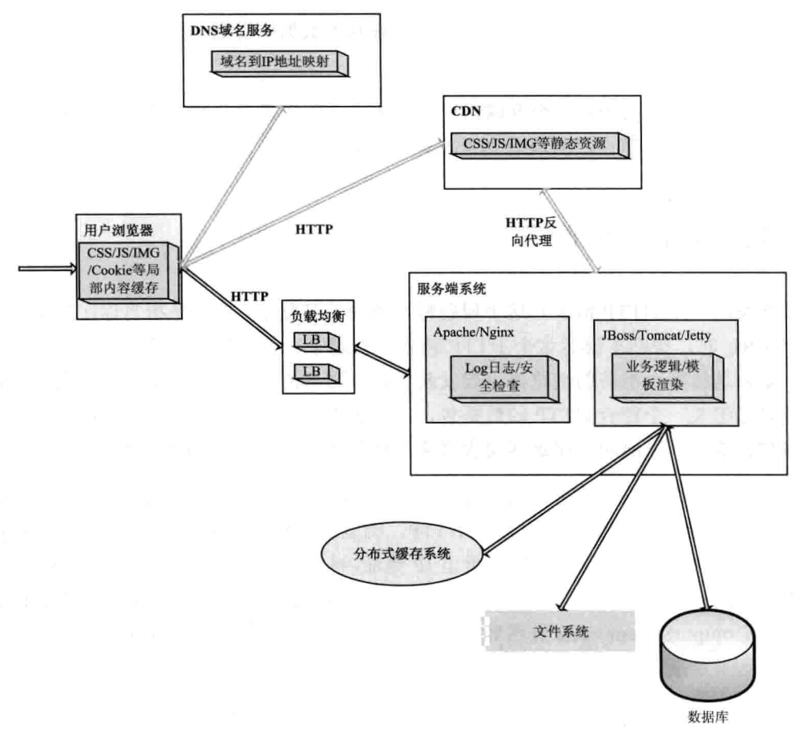

---
这篇文档是《深入分析Java Web技术内幕》的读书笔记。
---

# 第1章 深入Web请求过程
- B/S - Browser/Server

- 几种域名解析方式
    - A记录：即Address记录，可将多个域名指定到一个IP地址
    - MX记录，即Mail Exchange，将某个域名下的邮件服务器指向自己的Mail Server。如taobao.com域名的A记录IP是115.238.25.XXX，如果将MX记录设置为115.238.25.xxx，即xxx@taobao.com的邮件路由，DNS会将邮件发送到115.238.25.xxx所在的服务器，而正常通过Web请求的话仍然解析到A记录的IP地址。
    - CNAME记录，全称`Canonical Name`(别名解析)。如将`taobao.com`解析到`xulingbo.net`，将`srcfan.com`也解析到`xulingbo.net`，则`xulingbo.net`分别是`taobao.com`和`srcfan.com`的别名。
    - NS记录，为某个域名指定DNS解析服务器。
    - TXT记录，为某个主机名或域名设置说明，如可以为`xulingbo.net`设置TXT记录为“君山的博客”这样的说明。
- CDN (Content Delivery Network) = 镜像 + 缓存 + 整体负载均衡（GSLB）
- 负载均衡
    - 链路负载均衡
    - 集群负载均衡
    - 操作系统负载均衡

# 第2章 深入分析JAVA I/O的工作机制
- Java的4类IO
    - 基于字节（最小存储单位）操作的I/O接口： `InputStream`和`OutputStream`。
    - 基于字符操作的I/O接口： `Writer`和`Reader`。
    - 基于磁盘操作的I/O接口： `File`。
    - 基于网络操作的I/O接口： `Socket`。
- 几种访问文件的方式
    - 标准方式，内核缓存访问
    - 无缓冲方式，直接访问硬件磁盘
    - 同步访问文件方式，性能差，但能保证安全
    - 异步访问文件方式
    - 内存映射方式，将内存和某个磁盘区域关联，减少数据从内核空间缓存到用户空间缓存的数据复制操作

# 第4-8章 Java底层实现
- 编译过程
    - 词法分析 ：解析出每个单词
    - 语法分析 ：分析当前语句的语法，不结合上下文
    - 语义分析 : 结合上下文分析当前语法，包括是否定义，类型是否匹配等
- Java运行时数据分为6种：
    - PC寄存器数据；
    - Java栈，一个Java线程有一个Java栈，局部变量的基本类型，以及对象句柄（引用）分配在栈上，不被线程共享
    - 堆；存储new出来的Java对象，可被线程共享
    - 方法区；存储类结构信息，可被线程共享
    - 本地方法区；
    - 运行时常量池。

第9章 Servlet工作原理解析
